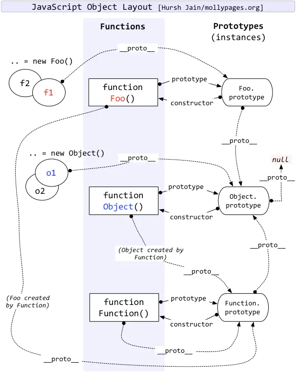

# Instanceof 的实现

其实就是比较实例原型是否是对象原型，要注意的是基础类型是不需要比较的。

基础类型:['string', 'number', 'boolean', 'undefine', 'symbol'];

注意的是 __proto__ 和 prototype 的关系

```
const instance_of = (L, R) => {
  const baseTypes = ['string', 'number', 'boolean', 'undefine', 'symbol'];
  if (baseTypes.includes(typeof L)) return false;

  const RPrototype = R.prototype;   // 对象的原型
  L = L.__proto__;                  // 示例化的原型 

  while (true) {
    if (L === null) return false;
    if (L === RPrototype) return true;
    L = L.__proto__;
  }
}
```

### 原型链关系图


